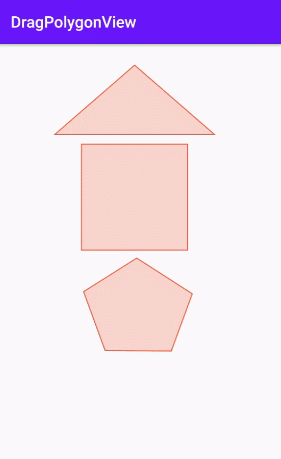

# DragPolygonView

[](https://raw.githubusercontent.com/jenly1314/DragPolygonView/master/app/release/app-release.apk)
[](https://bintray.com/beta/#/jenly/maven/dragpolygonview)
[](https://jitpack.io/#jenly1314/DragPolygonView)
[](https://travis-ci.org/jenly1314/DragPolygonView)
[](https://circleci.com/gh/jenly1314/DragPolygonView)
[](https://android-arsenal.com/api?level=21)
[](https://opensource.org/licenses/mit-license.php)
[](https://jenly1314.github.io/)
[](http://shang.qq.com/wpa/qunwpa?idkey=8fcc6a2f88552ea44b1411582c94fd124f7bb3ec227e2a400dbbfaad3dc2f5ad)

DragPolygonView for Android 是一个支持可拖动多边形，支持通过拖拽多边形的角改变其形状的任意多边形控件。

## 特性说明
- [x] 支持添加多个任意多边形
- [x] 支持通过触摸多边形拖动改变其位置
- [x] 支持通过触摸多边形的角改变其形状
- [x] 支持点击、长按、改变等事件监听
- [x] 支持多边形单选或多选模式

## Gif 展示


## DragPolygonView 自定义属性说明
| 属性 | 值类型 | 默认值 | 说明 |
| :------| :------ | :------ | :------ |
| dpvStrokeWidth | float | 4 | 画笔描边的宽度 |
| dpvPointStrokeWidthMultiplier | float | 1.0 | 绘制多边形点坐标时基于画笔描边的宽度倍数 |
| dpvPointNormalColor | color |<font color=#E5574C>#FFE5574C</font>| 多边形点的颜色 |
| dpvPointPressedColor | color | | 多边形点按下状态时的颜色 |
| dpvPointSelectedColor | color | | 多边形点选中状态时的颜色 |
| dpvLineNormalColor | color |<font color=#E5574C>#FFE5574C</font>| 多边形边线的颜色 |
| dpvLinePressedColor | color | | 多边形边线按下状态的颜色 |
| dpvLineSelectedColor | color | | 多边形边线选中状态的颜色 |
| dpvFillNormalColor | color |<font color=#E5574C>#3FE5574C</font>| 多边形填充的颜色 |
| dpvFillPressedColor | color |<font color=#E5574C>#7FE5574C</font>| 多边形填充按下状态时的颜色 |
| dpvFillSelectedColor | color |<font color=#E5574C>#AFE5574C</font>| 多边形填充选中状态时的颜色 |
| dpvAllowableOffsets | dimension | 16dp | 触点允许的误差偏移量 |
| dpvDragEnabled | boolean | true | 是否启用拖动多边形 |
| dpvChangeAngleEnabled | boolean | true | 是否启用多边形的各个角的角度支持可变 |
| dpvMultipleSelection | boolean | false | 是否是多选模式，默认：单选模式 |
| dpvClickToggleSelected | boolean | false | 是否点击就切换多边形的选中状态 |
| dpvAllowDragOutView | boolean | false | 是否允许多边形拖出视图范围 |
| dpvTextSize | dimension | 16sp | 是否允许多边形拖出视图范围 |
| dpvTextNormalColor | color |<font color=#E5574C>#FFE5574C</font>| 多边形文本的颜色 |
| dpvTextPressedColor | color | | 多边形文本按下状态的颜色 |
| dpvTextSelectedColor | color | | 多边形文本选中状态的颜色 |
| dpvShowText | boolean | true | 是否显示多边形的文本 |
| dpvFakeBoldText | boolean | false | 多边形Text的字体是否为粗体 |


## 引入

### Maven：
```maven
<dependency>
  <groupId>com.king.view</groupId>
  <artifactId>dragpolygonview</artifactId>
  <version>1.0.2</version>
  <type>pom</type>
</dependency>
```
### Gradle:
```gradle
implementation 'com.king.view:dragpolygonview:1.0.2'
```

### Lvy:
```lvy
<dependency org='com.king.view' name='dragpolygonview' rev='1.0.2'>
  <artifact name='$AID' ext='pom'></artifact>
</dependency>
```

###### 如果Gradle出现compile失败的情况，可以在Project的build.gradle里面添加如下：（也可以使用上面的GitPack来complie）
```gradle
allprojects {
    repositories {
        maven { url 'https://dl.bintray.com/jenly/maven' }
    }
}
```

## 示例

布局示例
```Xml
    <com.king.view.dragpolygonview.DragPolygonView
        android:id="@+id/dragPolygonView"
        android:layout_width="wrap_content"
        android:layout_height="wrap_content"/>
```

代码示例
```Java
    //添加多边形
    dragPolygonView.addPolygon(Polygon polygon);
    //添加多边形(多边形的各个点)
    dragPolygonView.addPolygon(PointF... points);
    //根据位置将多边形改为选中状态
    dragPolygonView.setPolygonSelected(int position);
    //改变监听
    dragPolygonView.setOnChangeListener(OnChangeListener listener);
    //点击监听
    dragPolygonView.setOnPolygonClickListener(OnPolygonClickListener listener);
    //长按监听
    dragPolygonView.setOnPolygonLongClickListener(OnPolygonLongClickListener listener)

```

更多使用详情，请查看[app](app)中的源码使用示例

## 版本记录

#### v1.0.2：2020-12-2
* Polygon新增Text属性（可显示在多边形中间）

#### v1.0.1：2020-10-23
* 新增点击和长按事件
* 新增选中相关状态

#### v1.0.0：2020-10-19
*  DragPolygonView初始版本

## 赞赏
如果您喜欢DragPolygonView，或感觉DragPolygonView帮助到了您，可以点右上角“Star”支持一下，您的支持就是我的动力，谢谢 :smiley:<p>
您也可以扫描下面的二维码，请作者喝杯咖啡 :coffee:
    <div>
        
        
        
        
    </div>

## 关于我
   Name: <a title="关于作者" href="https://about.me/jenly1314" target="_blank">Jenly</a>

   Email: <a title="欢迎邮件与我交流" href="mailto:jenly1314@gmail.com" target="_blank">jenly1314#gmail.com</a> / <a title="给我发邮件" href="mailto:jenly1314@vip.qq.com" target="_blank">jenly1314#vip.qq.com</a>

   CSDN: <a title="CSDN博客" href="http://blog.csdn.net/jenly121" target="_blank">jenly121</a>

   CNBlogs: <a title="博客园" href="https://www.cnblogs.com/jenly" target="_blank">jenly</a>

   GitHub: <a title="GitHub开源项目" href="https://github.com/jenly1314" target="_blank">jenly1314</a>

   Gitee: <a title="Gitee开源项目" href="https://gitee.com/jenly1314" target="_blank">jenly1314</a>

   加入QQ群: <a title="点击加入QQ群" href="http://shang.qq.com/wpa/qunwpa?idkey=8fcc6a2f88552ea44b1411582c94fd124f7bb3ec227e2a400dbbfaad3dc2f5ad" target="_blank">20867961</a>
   <div>
       
       
   </div>
